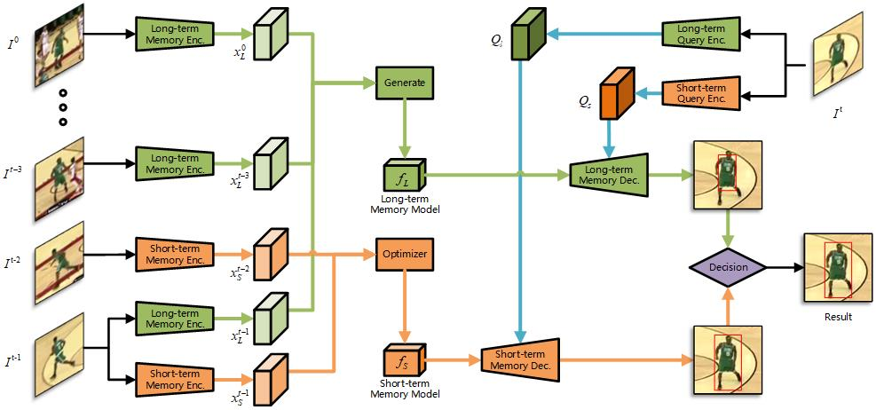

# DualMN: Dual-branch Memory Network for Visual Object Tracking

### We hope this work will attract more researchers/engineers to build more complete, robust and powerful memory networks for visual object tracking. Code and papers will be released publicly. 

## Architecture



#### Install dependencies

* Create and activate a conda environment 
    ```bash
    conda create -n DualMN python=3.8
    conda activate DualMN
    ```  
* Install PyTorch
    ```bash
    conda install -c pytorch pytorch torchvision cudatoolkit=10.0
    ```  

## Acknowledgement
This is a modified version of the python framework [PyTracking](https://github.com/visionml/pytracking) and [video_analyst](https://github.com/MegviiDetection/video_analyst) based on **Pytorch**.

## Contacts
* Jingchao Wang, Collage of Software Engineering, Zhengzhou University of Light Industry, China, 1402994066@qq.com

## Results
We obtain the state-of-the-art results on several benchmarks. 
More results are coming soon. 

<table>
  <tr>
    <th>Model</th>
    <th>OTB<br>Success(%)</th>
    <th>OTB<br>Precision (%)</th>
  </tr>
  <tr>
    <td>Short-term memory</td>
    <td>70.3</td>
    <td>91.0</td>
  </tr>
  <tr>
    <td>Long-term memory</td>
    <td>70.8</td>
    <td>91.9</td>
  </tr>
  <tr>
    <td>Dual-branch memory</td>
    <td>72.1</td>
    <td>92.9</td>
  </tr>
  <tr>
